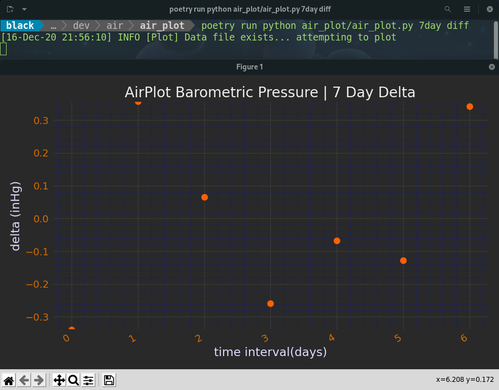

=================
air_plot
=================

A simple local barometric pressure measurement plotter using data from air_collect.

.. image:: images/Screenshot2Plotter.png
    :scale: 50

Installation
------------
This project is managed with Python Poetry (https://github.com/python-poetry/poetry). With Poetry installed correctly,
simply clone this project and run::

    poetry install

To test the project, run::

    poetry run pytest

In order to run the program functions, see below.

Introduction
------------
This project functions for one purposes.

1. To take collected and differential barometric pressure data and plot it on a basic Matplotlib GUI graph (air_plot.py).

The differential data in this project is supplied in order to gain insight into how quickly values are  changing in
certain air properties for certain time intervals, which could be a point of interest.

air_plot.py
~~~~~~~~~~~
air_plot.py is a simple process that takes the CSV files produced by the ``air_collect`` project and plots them on
a basic live update Matplotlib GUI graph.

The plotter can be run, from within the air_plot directory, in the following ways depending on what time interval
data you would like to plot::

    poetry run python air_plot/air_plot.py live
    poetry run python air_plot/air_plot.py 48hr
    poetry run python air_plot/air_plot.py 7day

The commands above can take an additional 'diff' flag which will plot the differential data of that time interval::

    poetry run python air_plot/air_plot.py live diff
    poetry run python air_plot/air_plot.py 48hr diff
    poetry run python air_plot/air_plot.py 7day diff

Finally, the live data has support for the 2nd order differential data::

    poetry run python air_plot/air_plot.py live diff2

Logs
-----
Process logs are generated in the project's root directory's log folder.

Commit Conventions
-------------------
Git commit conventions follows Conventional Commits message conventions explained in detail on their website
(https://www.conventionalcommits.org)
