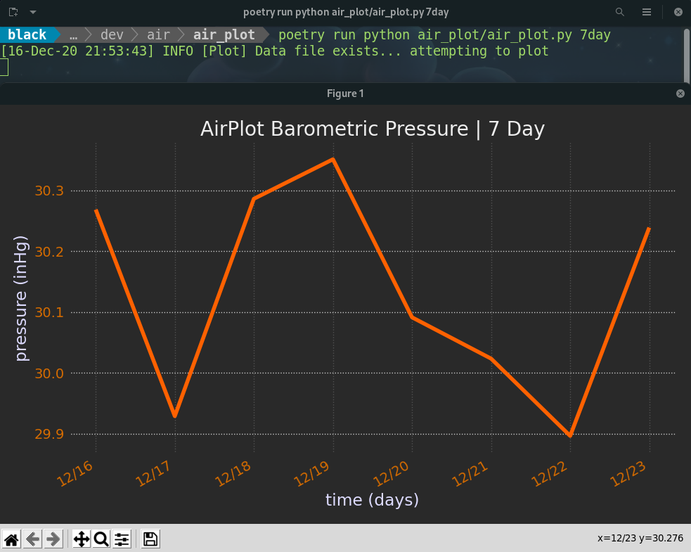

=================
Baronerd
=================

A simple local barometric pressure measurement logger and plotter using the DarkSky API

.. image:: images/ScreenshotPlotterDiff.png
    :scale: 50
.. image:: images/ScreenshotBarometricMetronome.png
    :scale: 50

Installation
------------
This project is managed with Python Poetry (https://github.com/python-poetry/poetry). With Poetry installed correctly,
simply clone this project and run::

    poetry install

To test the project, run::

    poetry run pytest

In order to run the program functions, see below.

Introduction
------------
This project functions for three purposes.

1. To collect the barometric pressure of a location using the DarkSky API (BarometricMetronome.py).
2. To generate differential information from the data collected (BarometricMetronome.py).
3. To take the data collected and differential data and plot it on a basic Matplot GUI graph (Plotter.py).

The differential data in this project is supplied in order to gain insight into how quickly certain time intervals are
changing in barometric pressure which could be a point of interest.

BarometricMetronome.py
~~~~~~~~~~~~~~~~~~~~~~
BarometricMetronome.py is named aptly as it is the process in charge of running continuously, polling the DarkSky API
for barometric pressure measurements. It takes the measurements collected from the API requests outputting them out to
the terminal, and aggregating them in the data folder as collection of CSVs. This process creates data files of
live barometric pressure readings, along with data files for the next 48hrs, and the next 7 days barometric pressures.
It also saves the differential processing of those data files in the differentials folder within the data folder.
Differentials are taken for the live, 48hr, and 7 day data feeds. BarometricMetronome.py requires that an ``.env`` file
is available in the *same* directory it is running under. The format of the .env file should contain ``DARK_SKY_API_KEY``,
``QUERY_API_INTERVAL``, ``NUM_OF_LIVE_READINGS``, and ``COORDINATES_LAT_LONG`` as defined environment values.

| ``DARK_SKY_API_KEY`` : The API key of a registered DarkSky account (https://darksky.net/dev)
| ``QUERY_API_INTERVAL`` : The amount of seconds to wait before querying the API, i.e. polling interval
| ``COORDINATES_LAT_LONG`` : The location's geographic coordinate system latitude and longitude
| ``NUM_OF_LIVE_READINGS`` : The max number of barometric values the live data file should hold at any given time. New values continue to be collected indefinitely as long as BarometricMetronome.py is run, but the oldest value is consistently truncated to stay within this predefined limit.

An explained ``.env`` file format is shown below::

    DARK_SKY_API_KEY=<your dark sky API key>
    QUERY_API_INTERVAL=<number of seconds between API requests>
    NUM_OF_LIVE_READINGS=<number of readings in the live csv file>
    COORDINATES_LAT_LONG=<'lat, long' coordinates>

A typical ``.env`` file may look like this::

    DARK_SKY_API_KEY=<your dark sky API key>
    QUERY_API_INTERVAL=3600
    NUM_OF_LIVE_READINGS=168
    COORDINATES_LAT_LONG='40.71427,-74.00597'

To run the script once the environment (.env) file is created, from within the baronerd directory, simply type::

    poetry python BarometricMetronome.py

Plotter.py
~~~~~~~~~~
Plotter.py is a simple process that takes the CSV files produced by the BarometricMetronome.py script and plots them on
a basic live update Matplot GUI graph.

The plotter can be run, from within the baronerd directory, in the following ways depending on what time interval
data you would like to plot::

    poetry python Plotter.py live
    poetry python Plotter.py 48hr
    poetry python Plotter.py 7day

The commands above can take an additional 'diff' attribute which will plot the differential data of that time interval::

    poetry python Plotter.py live diff
    poetry python Plotter.py 48hr diff
    poetry python Plotter.py 7day diff

Finally, the live data has support for the 2nd order differential data::

    poetry python Plotter.py live diff2

Commit Conventions
----------------------
Git commit conventions follows AngularJS commit message conventions explained in detail on their GitHub
(https://gist.github.com/stephenparish/9941e89d80e2bc58a153)
